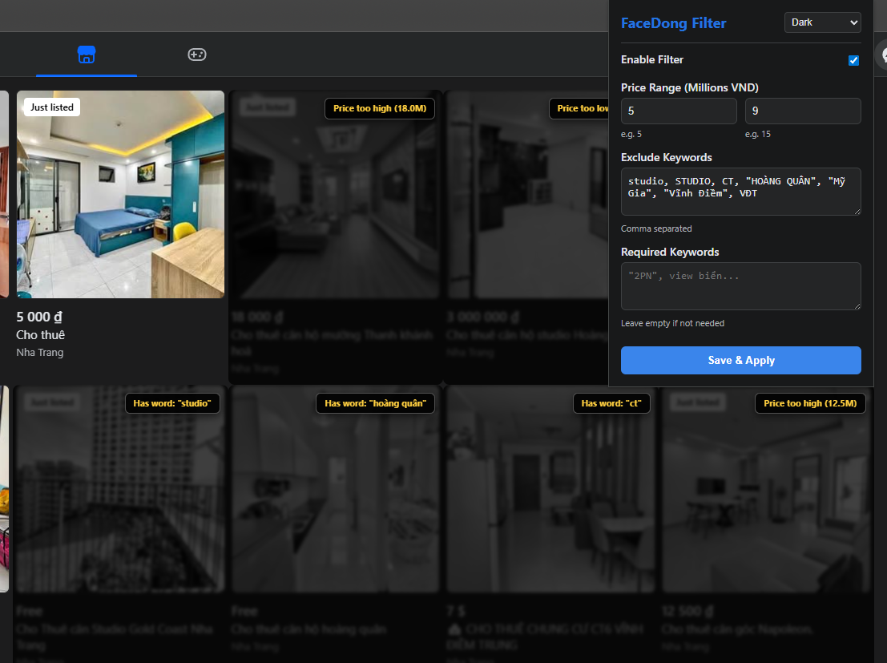

# FaceDong
**FaceDong Filter** — a chrome extension that adds more filters to Facebook Marketplace in the harsh Vietnamese real estate rentals market.
Purely vibecoded.

## How it looks?

## What problem is being solved?
If you have ever tried renting apartments in Vietnam on FB Marketplace, you may know the struggle. 
The platform lacks basic filtering instruments, and the listings themselves are a primarily a mess:
- A price of **"10"** usually means 10 million VND.
- A price of **"135"** means 13.5 million VND.
- A price of **"1350"** also means 13.5 million VND.
- Some prices are listed as **"Free"**, hiding the real cost in the description.
- There's no way to exclude annoying keywords like "studio" or specific districts.

FaceDong fixes all of this.

## Features
- 🧠 **Smart Price Normalization**: Automatically converts shorthand (9, 135, 1350, 9000) into actual Millions of VND.
- 🔍 **Real-time Keyword Filtering**: Dims listings containing excluded words (e.g., "studio") or missing required words.
- 🌑 **Dark/Light Mode**: Matches your system theme or can be toggled manually in the popup.
- 📜 **Infinite Scroll Support**: Keeps filtering as you scroll down the Marketplace feed.
- 🏷️ **Reason Badges**: Every filtered listing shows exactly why it was hidden (e.g., "Price too high" or "Has word: studio").
- ⚡ **Instant Re-scan**: Changes applied in the popup take effect immediately without a page refresh.

## How to use it?

### Installation
1. Download or clone this repository.
2. Open Chrome and navigate to `chrome://extensions/`.
3. Enable **Developer mode** (toggle in the top right).
4. Click **Load unpacked** and select the folder containing FaceDong.
5. Head over to [Facebook Marketplace](https://www.facebook.com/marketplace/) and start searching!

### Tips
- **Quotes for Phrases**: Use quotes in the keyword fields to filter exact phrases, e.g., `"view biển"` or `"2 bedroom"`.
- **Price Range**: Enter your min/max prices in **Millions VND** (e.g., enter `5` for 5,000,000).
- **Hover to Reveal**: Filtered listings are dimmed but not deleted. Just hover over them to see the original content.

## Tech Stack
- Vanilla JavaScript
- MutationObserver API for real-time DOM tracking
- Chrome Storage API for settings persistence
- CSS custom properties for theming

---
*Created with 💙 for the Nha Trang rental hunt.*
